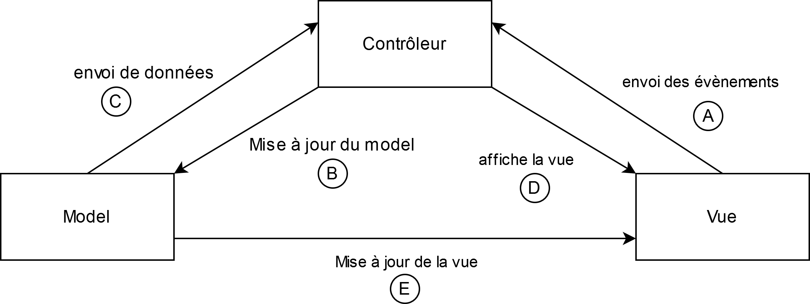
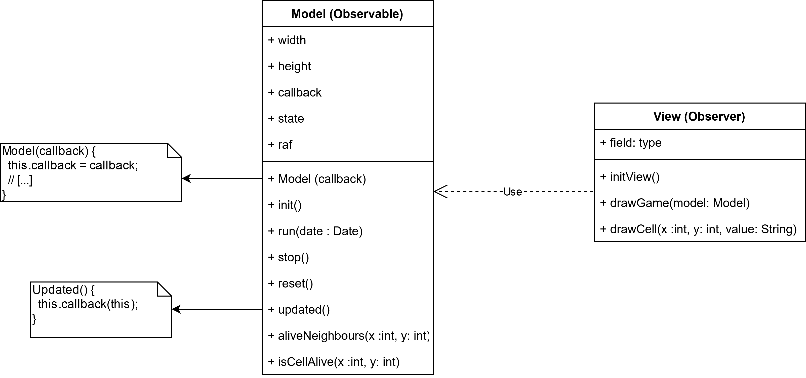

# ISI3 - MVP design pattern - "Game of Life"

> Le rapport est à fournir dans ce document sous chacune des questions.
> **Ne restez pas bloqués bêtement, demander de l'aide**
> Ne copier pas le code de votre voisin, ça se voit.

Nom/Prénom: `Abdou-Rahimi Nassère`

Lien du codesandbox: [lien](https://codesandbox.io/s/practical-thunder-tsj7v)

> Pour générer un codesandbox associé à votre code, [suiver cette doc](https://codesandbox.io/docs/importing#import-from-github)

## Game of Life

Le jeu de la vie est un automate cellulaire qui répond à des règles très simple.
Il est inventé par [John Horton Conway](https://fr.wikipedia.org/wiki/John_Horton_Conway)(1937-2020).

## Avant-propos

1. Expliquer le design pattern MVC à l'aide d'un schéma à insérer directement ici.
   Utiliser un outils commde Dia pour le représenter. Je veux **votre** schéma, pas un de ceux qu'on peut trouver sur le net.

Dans le pattern MVC, on distingue trois parties, "Modèle","Vue", Contrôleur". Chacun a son propore rôle : La vue se charge de l'affichage des données, le modèle contient toutes les données et le contrôleur fait le lien entre les deux.

Détails à travers différents exemples :

1er scénario : Demande d'une vue (sans données)

L'utilisateur effectue une action qui est renvoyé au Contrôleur. (A)  
Celui-ci vérifie que l'utilisateur peut effectuer cette action puis lui retourne la Vue demandée. (D)

2ème scénario : Demande d'une vue (avec données)

L'utilisateur effectue une action qui est renvoyé au Contrôleur. (A)  
Le Controleur met à jour le Modèle (B), récupère les données (C) et les transmet à la Vue qui les affiche (D).

3ème scénario : Changement/Action sur le modèle
L'utilisateur effectue une action qui est renvoyé au Contrôleur. (A)  
Le Controleur met à jour le Modèle (B).  
Le Modèle informe la Vue d'un changement (E) puis la Vue met à jour l'affichage.

2. Expliquer ce pattern à l'aide en complétant ce texte.

Le pattern MVP, vise à découper le `modèle`, de la `vue` et du `contrôleur` afin de rendre le code plus `structuré`.
Les responsabilités ne sont alors plus `réunis`.
On peut ainsi changer l'aspect visuel de son application sans pour autant impacter le `modèle`.

3. Expliquer dans quels cas on doit privilégier le pattern MVC.

_On doit privilégier le pattern MVC dans toute application disposant de vues susceptibles de changer selon les actions du client._

## A faire (obligatoire)

- Rendre le jeu fonctionel tout en respectant le design pattern MVC.
- Le bouton `start` doit lancer le jeu.
- Le bouton `stop` doit arrêter le jeu en l'état, le `start` relance le jeu.
- le bouton `reset` arrête le jeu et vide remet à la grille à l'état initiale.

### Observer Observable

Afin de mettre à jour la vue à chaque nouvelle génération du jeu, la fonction `updated` doit notifier la view afin qu'elle se mette à jour.
En quoi cela relève du design pattern ObserverObservable.

1. Expliquer votre implémentation:

L'usage d'une callback permet ici de `faire appel à la méthode DrawGame` afin dire à la _View_ de se redessiner.
L'objet _Model_ n'a pas de lien avec `la Vue` pourtant grâce à la `callback` il peut notifier la `Vue`.

2. Insérer ici un UML montrant le pattern Observer-Observable liés aux objects de ce TP.

_La classe Model joue le rôle d'Observable et la classe View joue le rôle d'observer._
_A l'itialisation, Model reçoit comme callback, la méthode DrawGame de View._
_A chaque modification du Model, celui-ci appelle sa fonction updated qui elle effectue l'appel callback. Ainsi, la vue reçoit les changements et est alors capable de redessiner la grille._

## Optionel

> Si vous voulez apprendre d'autres choses

- Faire sorte de pouvoir changer les dimensions de la grille par in `<input/>` HTML.
- Faire en sorte de pouvoir modifier l'état d'une cellule en cliquant dessus.

## :warning: À rendre

- Une URL de codesandox pointant sur votre projet github afin que je puisse voir et tester le code.
- Le rapport complet.
